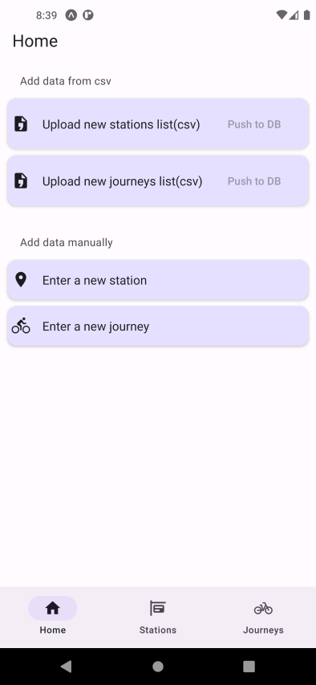
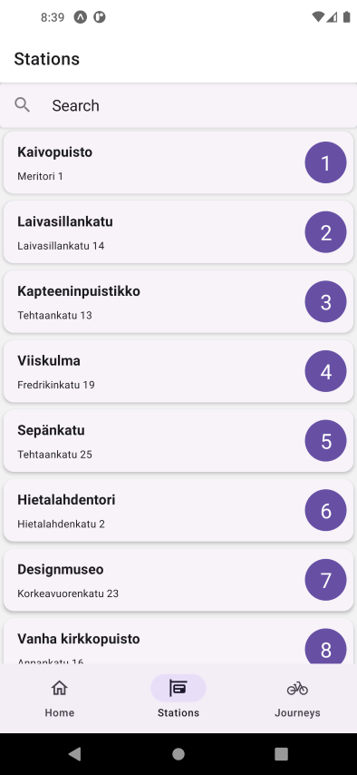
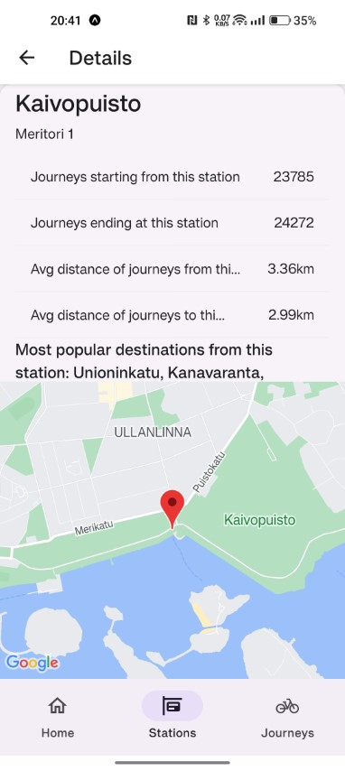
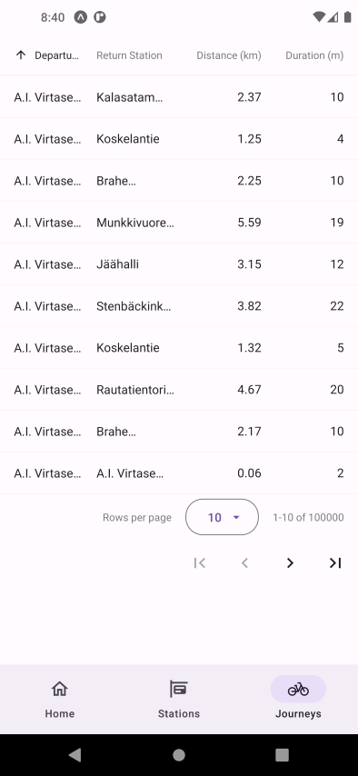

# Solita Dev Academy pre-assignment 2023

## Applicant name :Huy Nguyen
A repository for Solita Dev Academy 2023 pre-assignment


Technology stack used: Back-end: Node.JS with Express - Database: PostgreSQL. Front-end: ReactNative and Flutter on Android.<br>
Note: the repository contains some api keys & links to private server, they'll be changed after 2 weeks.

## Backend: 

> <em>A NodeJS server with APIs to access PostgreSQL database. Stations and journeys data are stored on a PostgreSQL running on my linode VPS.<br>
> Postgres database have 2 tables: stations (id:integer primary key, name: varchar255,address: varchar255,x: real,y: real) and journeys (id:serial primary key,departure_time: timestamp, return_time: timestamp, departure_station_id: integer,departure_station: varchar255, return_station_id: integer, return_station: varchar255, distance: real, duration: real)<br>
> Sample data was loaded to postgres using backend functions in 2 databases. citybike_prod: all original imported data. citybike contains original data and new testing related data in the development process.<br>
> 
>In the data import process, several stations were not found in the stations data provided in the csv. In order to prevent conflicts, no relationship between two table was set up.</em>


### Dependencies

- [`body-parser`](https://www.npmjs.com/package/body-parser) & [`express`](https://www.npmjs.com/package/express): web server framework
- [`fast-csv`](https://www.npmjs.com/package/fast-csv): CSV Parser and Formatter

- [`multer`](https://www.npmjs.com/package/multer): middleware for uploading files handling
- [`pg`](https://www.npmjs.com/package/pg), [`pg-promise`](https://www.npmjs.com/package/pg-promise), [`pg-hstore`](https://www.npmjs.com/package/pg-hstore): PostgreSQL client for Node.js
- [`dotenv`](https://www.npmjs.com/package/dotenv), [`dotenv`](https://www.npmjs.com/package/cross-env), [`nodemon`](https://www.npmjs.com/package/nodemon): loads environment variables from .env file, script monitoring
- [`jest`](https://www.npmjs.com/package/jest), [`supertest`](https://www.npmjs.com/package/supertest): testing http api calls

### To run the backend from git

### Prerequisites: [Node.JS](https://nodejs.org/en/) , [Docker](https://www.docker.com/) (optional)

1. Clone the repository, go to <em>backend</em> folder using terminal:

```sh
git clone https://github.com/nnq-huy/huynguyen-preassignment-2023.git
cd backend
```

2. Install dependencies:

```sh
npm install
```

3. Replace PGPASSWORD in env.dev , env.test, env.production with "abc123"
4. Run the tests with test database

```sh
npm test
```

5. Run the backend with dev/production database

```sh
npm start-dev
```
or
```sh
npm start
```
### To run the backend from docker
1. Pull docker images
```sh
docker pull nnqhuy/citybikebackend:latest
```
2. Run the image
```sh
docker run -p 3000:3000 nnqhuy/citybikebackend
```
API endpoints running on my Linode VPS:

<ul>
<em>
<li>GET: http://143.42.29.50:3000/ </li>
<li>GET: http://143.42.29.50:3000/stations </li>
<li>GET: http://143.42.29.50:3000/journeys </li>
<li>GET: http://143.42.29.50:3000/stations/id=1 </li>
<li>POST: http://143.42.29.50:3000/upload/stations with a field "file" and a file in formdata</li>
<li>POST: http://143.42.29.50:3000/journeys/new with a JSON object in request body </li>
<li>POST: http://143.42.29.50:3000/stations/new with a JSON object in request body </li>

</em>
</ul>

## Frontend: a ReactNative application created with Expo, configured to run on Android
### Prerequisites: [Node.JS](https://nodejs.org/en/), [JavaJDK](https://openjdk.org/), [AndroidSDK](https://developer.android.com/studio), Android Emulator/Expo Go app (optional).

### To test the app

1. Clone the repository(if backend setup step is skipped), go to react-native-front-end folder using terminal:

```sh
git clone https://github.com/nnq-huy/huynguyen-preassignment-2023.git
cd react-native-front-end
```

2. Install dependencies:

```sh
npm install
```

3. Start expo metro bundler:

```sh
npx expo start
```

4. Press "a" on terminal to start application on Android Emulator/Android Phone

### Screenshots:





## Frontend: a Flutter application configured to run on Android
### Prerequisites: [Flutter](https://flutter.dev/) version 3.0 and up, [AndroidSDK](https://developer.android.com/studio), Android Emulator/ Android phone

### To test the app

1. Clone the repository(if backend setup step is skipped), go to flutter-front-end folder using terminal and run the app
   or download the apk file: https://1drv.ms/u/s!AhUnCCd__w0BjsdrpnizEGApUVCVaQ?e=6Y88vM and install on the emulator/android phone.

```sh
git clone https://github.com/nnq-huy/huynguyen-preassignment-2023.git
cd flutter-front-end
```

1. Install dependencies:

```sh
flutter pub get
```
3. Start the debug build on emulator/phone or web

```sh
flutter run
```
or
```sh
flutter run -d chrome
```

## Project folder structure


<em>

```
backend/
├─ controllers/                     # Server functions
│  ├─ csv_to_db.js                  # CSV parsing and pushing to db functions
│  ├─ db_queries.js                 # Database queries functions
│  ├─ file_upload.js                # Files uploading functions
├─ csv/                             # Sample csv files
│  ├─ journeys.csv                  # CSV file contains 9 sample journeys records
│  ├─ stations.csv                  # CSV file with sample station data
├─ routes/                          # API endpoints routes
│  ├─ index.js
├─ tests/                           # Test files
│  ├─ routes.test.js                # API integration tests
│  ├─ testfile.csv                  # File for uploading test
│  ├─ validation.test.js            # Data validation for db import tests
├─ .gitignore
├─ .dockerignore
├─ Dockerfile                       # Docker config file
├─ index.js                         # Server entry file
├─ package.json                     # App information & dependencies
```

```
react-native-front-end/
├─ assets/                          # Expo's default assets
├─ src/                             # Source files
│  ├─ components/
│  │  ├─ StationDetail.tsx          # Station's detail view
│  │  ├─ StationList.tsx            # Stations list view
│  ├─ screens/
│  │  ├─ HomeScreen.tsx             # Home screen
│  │  ├─ index.ts                   # Exported screens
│  │  ├─ JourneysScreen.tsx         # Journeys list screen
│  │  ├─ StationsScreen.tsx         # Station screen
│  ├─ utils/
│  │  ├─ backend.ts                 # Link to backend
│  │  ├─ types.ts                   # Data types
├─ .gitignore
├─ app.json                         # App's info
├─ App.tsx                          # App's main file
├─ babel.config.js                  # React's babel config
├─ package.json                     # App's dependencies & configurations
├─ tsconfig.json                    # TypeScript configuration file
```
```
flutter-front-end/
├─ android/                         # Flutter's configs for android
├─ lib/                             # Source files
│  ├─ components/                   # Building block widgets
│  ├─ constants/                    # Link to backend
│  ├─ helpers/                      # Backend calling functions
│  ├─ models/                       # Data types
│  ├─ screens/                      # App's 3 screens
├─ .gitignore
├─ test/                            # Tests
├─ web/                             # Web configs
├─ pubspec.yaml                     # App's dependencies & configurations
```
</em>
